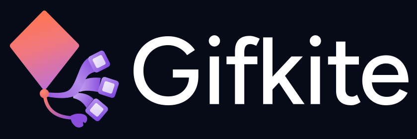

<p align="center">
  <picture>
    <source media="(prefers-color-scheme: dark)" srcset="docs/assets/gifkite-logo-dark.svg">
    <source media="(prefers-color-scheme: light)" srcset="docs/assets/gifkite-logo-light.svg">
    
  </picture>
</p>

<p align="center">
  <strong>The Pro Screen-to-GIF Recorder for macOS, Windows & Linux</strong><br>
  Crafted for clarity, speed, and beautiful pixel-perfect loops.
</p>

<p align="center">
  <a href="https://github.com/gifkite/gifkite/actions/workflows/ci.yml"></a>
  <a href="https://gifkite.github.io/gifkite/"></a>
  <a href="https://github.com/gifkite/gifkite/releases"></a>
</p>

---

A fast, lightweight Gifox-style screen-to-GIF recorder with menu bar / system tray popover, interactive region picker, floating controls, timeline trimmer, Bayer dithering, and high-visibility cursor tracking. Written in Go with Wails v3.

🌐 **Website & Interactive Demo**: [https://gifkite.github.io/gifkite/](https://gifkite.github.io/gifkite/)

## Quick Start & Build

Needs Go 1.25+. You can build using [`go-task`](https://taskfile.dev) or standard Go commands:

### Using Taskfile (`task`)

```bash
task dev            # Build and launch Gifkite.app on macOS
task test           # Run all unit tests
task build:mac      # Package Gifkite.app bundle (with icons and ad-hoc signature)
task build:windows  # Cross-compile standalone gifkite.exe with embedded icon
task build:linux    # Build Linux binary (requires GTK3 / WebKitGTK dev headers)
task clean          # Remove build artifacts
```

### Manual Build

- **macOS**: Needs Xcode command-line tools.
  ```bash
  ./build-app.sh    # Builds binary and packages Gifkite.app bundle
  open Gifkite.app
  ```
  *Grant Screen Recording permission in System Settings on first launch.*

- **Windows**: Compiles natively or via cross-compilation with zero CGO dependencies:
  ```bash
  go build -ldflags="-H windowsgui -s -w" -o gifkite.exe .
  ```
  *(The `-H windowsgui` flag suppresses the console window and embeds the native app icon).*

- **Linux**: Requires GTK3 and WebKitGTK 4.1 development libraries:
  ```bash
  sudo apt install libgtk-3-dev libwebkit2gtk-4.1-dev
  go build -ldflags="-s -w" -o gifkite .
  ```

---

## Features

- **Menu Bar & Tray Popover**: Click the tray icon to open recent recordings, launch captures, toggle settings, or drag files out.
- **ScreenCaptureKit Engine (macOS 12.3+)**:
  - Upgraded from `kbinani/screenshot` to Apple's native hardware-accelerated capture pipeline for silky-smooth 60 FPS recording with lower CPU and battery consumption.
  - **True Window Isolation**: Captures a window independently (`initWithDesktopIndependentWindow:`), recording only that window's pixels even when covered by other windows or moved across spaces.
  - Seamless fallback to `kbinani/screenshot` on older macOS versions and cross-platform targets.
- **Pixel Loupe (Magnifier)**:
  - 4x circular zoom lens under the cursor with pixel crosshair and coordinates badge when dragging selection boxes or adjusting resize handles for pixel-perfect edge alignment.
- **Multi-Format Export (WebP & MP4)**:
  - Export to animated WebP or lightweight H.264 MP4 alongside standard GIF.
  - One-click format selector directly in the Review window and persistent default format configuration in Settings.
- **Basic Annotations**:
  - Interactive annotation toolbar right inside the Review player:
    - **Arrows**: Directional indicator lines with arrow heads and custom color swatches.
    - **Redact / Blur**: Mosaic pixelation boxes to obscure sensitive credentials, tokens, and personal info before saving.
    - **Text Captions**: Clean text captions with high-contrast pill backings.
- **Gifox-Style Region & Window Selection**:
  - Hover over any application window to highlight and snap to its exact frame.
  - Drag to draw a custom capture box with 8 resize handles and center-drag positioning.
  - Floating dialog with live dimension inputs (`W × H px`), aspect ratio presets (`Free`, `16:9`, `4:3`, `1:1`, `9:16`, `3:2`), and <kbd>Shift</kbd>-drag proportional locking.
  - Selection overlay is transparent directly on top of your live desktop.
- **Shortcuts**:
  - `Cmd+Shift+5` (macOS) / `Ctrl+Shift+5` (Win/Linux): Window capture mode (snap to any window).
  - `Cmd+Shift+6` (macOS) / `Ctrl+Shift+6` (Win/Linux): Region capture mode.
  - `Cmd+Shift+7` (macOS) / `Ctrl+Shift+7` (Win/Linux): Record active display full screen.
  - `Cmd+Option+P` (macOS) / `Alt+Ctrl+P` (Win/Linux): Pause / Resume recording.
  - `Cmd+Escape` (macOS) / `Ctrl+Escape` (Win/Linux): Stop recording anywhere.
  - In picker: `Space` or `Enter` to record, `Cmd+A` / `Ctrl+A` for full screen, `Esc` to cancel.
- **Floating Recording Pill**: On-screen elapsed timer, pause/resume, stop, and discard buttons (excluded from recorded frames using OS-level capture affinity).
- **Review & Timeline Trimmer**: Scrub frame-by-frame through captured footage, set in/out trim handles, toggle playback speeds (`1x`, `1.5x`, `2x`), preview the trimmed loop, and use keyboard shortcuts (`Space` to play/pause, `←`/`→` to step, `Enter` to save).
- **Auto-Copy & Notifications**: Automatically copies the finished recording to your clipboard upon save and delivers a native OS notification.
- **Bayer Spatial Dithering**: 4×4 ordered dithering eliminates color banding on gradients while maintaining compact GIF file sizes. Also supports Floyd-Steinberg and posterized (none).
- **Cursor Effects & Click Ripples**: High-visibility mouse cursor tracking, soft translucent spotlight halo, and animated expanding ripple rings on left and right clicks.
- **Multi-Display Support**: Automatically detects which monitor your cursor is on across mixed-DPI setups.
- **Headless CLI Recording**:
  ```bash
  gifkite record -region 100,100,800,500 -duration 10s -dither bayer -cursor -highlight -ripples -o demo.gif
  gifkite displays
  ```

---

## Project Structure

| File / Folder | Purpose |
|---|---|
| `app.go` | Wails v3 lifecycle: tray, popover, transparent picker, controls pill, global hotkeys |
| `service.go` | Recording state machine, settings bindings, notifications, and audio dispatch |
| `windows_darwin.go` | macOS Cocoa window enumeration (`CGWindowListCopyWindowInfo`) and mouse events |
| `windows_windows.go` | Windows Win32 window enumeration (`EnumWindows`, `DWMWA_EXTENDED_FRAME_BOUNDS`) and input tracking |
| `windows_linux.go` | Linux X11 window enumeration (`_NET_CLIENT_LIST`) and pointer tracking via `xgb` |
| `drag_darwin.m`, `drag_darwin.go` | macOS Cocoa `NSDraggingSession` for dragging GIFs directly into Slack/Finder |
| `drag_windows.go` | Windows capture exclusion via `SetWindowDisplayAffinity(WDA_EXCLUDEFROMCAPTURE)` |
| `drag_linux.go` | Linux capture and drag stubs |
| `cursor.go` | Cursor spotlight halo, animated click ripple rings, and `ClickTracker` |
| `recorder.go`, `quantize.go`, `encoder.go` | Frame grabber, global palette quantization, and differential GIF encoder |
| `library.go` | Recent recordings library, thumbnail caching, clipboard copy, and file reveal |
| `settings.go` | User settings persistence in OS app config directories |
| `icon.go` | Embedded template and full-color tray icons |
| `Taskfile.yml` | Cross-platform task runner recipes (`task dev`, `task build:windows`, etc.) |
| `frontend/` | Embedded HTML/CSS/JS frontend (no Node.js build step needed) |
| `docs/` | Static marketing landing page deployed via GitHub Pages |
